# Improve Your Architecture With Amazon CloudFront


[WorkShopのリンク](https://catalog.us-east-1.prod.workshops.aws/workshops/4557215e-2a5c-4522-a69b-8d058aba088c/en-US)

## アーキテクチャ


CloudFrontのディストリビューションに対して、3つのオリジンがぶら下がっている。

* S3 Bucket：静的サイトを提供
* API Gateway：静的サイトのバックエンドとなるAPIを提供
* Elemental MediaPackage：静的サイトで使用する動画を提供

API Gatewayにぶら下がっているLambda関数は以下である。

| No  | 関数名（パス）  | 説明                                                                                                                                                                                                                           |
| --- | --------------- | ------------------------------------------------------------------------------------------------------------------------------------------------------------------------------------------------------------------------------ |
| 1   | echo            | リクエストの中身を返却するのみ。動確用の位置付け。                                                                                                                                                                             |
| 2   | login           | ログイン処理を行う。CookieにセッションIDとログイン時刻を設定する。ユーザー名とパスワードはLambdaの環境変数で設定したもののみ有効。Cookie(cloudfront-workshopSessionId)が存在する場合はログイン済と判定する。                   |
| 3   | logout          | ログアウト処理を行う。Cookie(cloudfront-workshopSessionId)のMax-Ageを0にする。                                                                                                                                                 |
| 4   | sessionvalue    | CookieからセッションIDとログイン時刻を取得して返却する。                                                                                                                                                                       |
| 5   | staleobject     | 環境変数に設定したHTTPステータスコードを元にレスポンスを返却するだけの関数。オリジンからエラーが返ってきた時も、キャッシュが生き残っている間はディストリビューションから正常な結果が返せることを確認するために、使用する関数。 |
| 6   | fle             | クエリストリングをパースすして返却するだけの関数。Field Level Encryption の動作確認時に使用する関数。                                                                                                                          |
| 7   | getsignedcookie | CloudFrontから署名付きCookieを取得するための関数。                                                                                                                                                                             |
| 8   | getplayurl      | Elemental MediaPackageのAssetから動画のパスを取得して返却する関数。                                                                                                                                                            |


## プロジェクト構成

```sh
.
├── README.md
├── architecture.drawio.svg
├── bin
│   └── workshop_cloudfront.ts
├── cdk.json
├── cdk.out
├── jest.config.js
├── lib
│   ├── construct
│   │   ├── distribution.ts # CloudFront Distributionおよびオリジン（S3）を定義
│   │   ├── media.ts # オリジン（Elemental Media Package）を定義
│   │   └── restapi.ts # オリジン（API Gateway）を定義
│   ├── origin_contents # 動作確認用のコンテンツ
│   ├── failover_contents # オリジンフェイルオーバーテスト用コンテンツ
│   ├── lambda # API GWのバックエンドのLambda実装
│   ├── media_contents # オリジン（Elemental MediaPackage）のコンテンツ
│   └── workshop_cloudfront-stack.ts
├── package-lock.json
├── package.json
├── parameter.ts # 環境依存パラメータを定義
├── test
│   ├── __snapshots__
│   └── workshop_cloudfront.test.ts
└── tsconfig.json
```

## デプロイ方法
* 以下で公開鍵と秘密鍵を設定

```sh
openssl genrsa -out CloudFront-Workshop-Private-Key.pem 2048; openssl rsa -pubout -in CloudFront-Workshop-Private-Key.pem -out CloudFront-Workshop-Public-Key.pem;\n
```

* `parameter.ts`で各種パラメータを設定し、`cdk deploy`
  * ただし`cloudFrontKeypairId`と`websiteDomain`は一旦仮の値を設定してデプロイし、生成されたものを後から生成し、再デプロイを行う。
  * 上記のパラメータは CloudFront -> API Gateway -> Lambda で呼び出される Lambdaの環境変数で使用している値だが、CDKで参照させると、CloudFrontと循環参照を起こしてしまうため、やむなく手動設定および再デプロイの対応としている。

* `parameter.ts`で`cloudFrontKeypairId`と`websiteDomain`を設定し、再度`cdk deploy`

